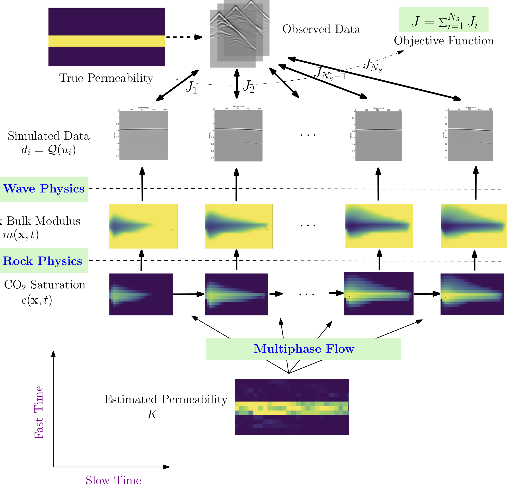

# FwiFlow: Wave and Flow Inversion with Intelligent Automatic Differentiation





FwiFlow is a package for XXX that implements the idea of **intelligent automatic differentiation**.  FwiFlow modularizes different components of numerical PDE simulation by It includes a GPU-accelerated [high performance full-waveform inversion module](./src/Ops/FWI/Src).


| Documentation                                                |
| ------------------------------------------------------------ |
| [](https://lidongzh.github.io/FwiFlow.jl/dev) |


## Tutorial on Custom Operators

The core library in FwiFlow provides several numerical solvers or operators for linear and nonlinear PDEs. They are equipped with automatic differentiation functionalities (the solution is differentiable with respect to certain parameters) and can be used as a submodule in a system model. 

The list of operators provided are

| API          | Description                | Note                              |
| ------------ | -------------------------- | --------------------------------- |
| `poisson_op` | Poisson Equation Solver    | Central Average Finite Difference |
| `upwlap_op`  | Laplacian Operator         | Upwinding Finite Difference       |
| `upwps_op`   | Poisson Equation Solver    | Upwinding Finite Difference       |
| `sat_op`     | Saturation Equation Solver |                                   |

For example, we can solve the Poisson equation with `poisson_op`

$\begin{aligned}

-\nabla\cdot(c(x) \nabla u(x)) &=  & x\in \Omega\\

\frac{\partial u(x)}{\partial n} &=  & x\in \Omega\\

\end{aligned}$

where $\Omega=[0,n_zh]\times [0, n_xh]$. The equation is solved using finite difference method, where the step size in each direction is $h$. Mathematically, the solution to the PDE is determined up to a constant. Numerically, we discretize the equation with the scheme

\```math

(A+E_{11})\mathbf{u} = \mathbf{f}

\```

where $A$ is the finite difference coefficient matrix,

\```math

(E_{11})_{ij} = \begin{cases}1 & i=j=1 \\ 0 & \mbox{ otherwise }\end{cases}

\```


##  Example


## Research Papers

## LICENSE
MIT License
Copyright (c) 2019 Dongzhuo Li and Kailai Xu


