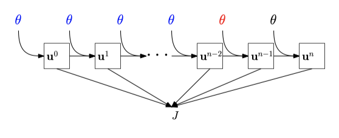

# FwiFlow: Wave and Flow Inversion with Intrusive Automatic Differentiation

| Quick Install                   | Documentation                                                |
| ------------------------------- | ------------------------------------------------------------ |
| `using Pkg; Pkg.add("FwiFlow")` |  |

## Highlights

- GPU-accelerated FWI module with checkpointing schemes;
- AMG-accelerated implicit pressure-implicit saturation scheme;
- Time Fractional Partial Differential Equations

## Philosophy

We treat physical simulations as a chain of multiple differentiable operators, such as discrete Laplacian evaluation, a Poisson solver and a single implicit time stepping for nonlinear PDEs. They are like building blocks that can be assembled to make simulation tools for new physical models. 

Those operators are differentiable and integrated in a computational graph so that the gradients can be computed automatically and efficiently via analyzing the dependency in the graph. Independent operators are parallelized executed. With the gradients we can perform gradient-based PDE-constrained optimization for inverse problems. 

FwiFlow is built on [ADCME](https://github.com/kailaix/ADCME.jl), a powerful static graph based automatic differentiation library for scientific computing (with TensorFlow backend). FwiFlow implements the idea of **Intrusive Automatic Differentiation**. 

  

## Applications

The following examples are for inversion 

|      |              |  |
| ------------------------------------------------------------ | ------------------------------------------------------------ | --------------------------------------------------- |
| [Full-waveform Inversion](https://lidongzh.github.io/FwiFlow.jl/dev/tutorials/fwi/) | [Two Phase Flow](https://lidongzh.github.io/FwiFlow.jl/dev/tutorials/flow/) | FWI-Two Phase Flow Coupled Inversion                |
|              |                                                              |                                                     |
| [Time Fractional PDE](https://lidongzh.github.io/FwiFlow.jl/dev/tutorials/timefrac/)                                          |                                                              |                                                     |

## Research Papers
1. **Dongzhuo Li** (co-first author), **Kailai Xu** (co-first author), Jerry M. Harris, and Eric Darve. [*Coupled Time‐Lapse Full‐Waveform Inversion for Subsurface Flow Problems Using Intrusive Automatic Differentiation*](https://arxiv.org/abs/1912.07552), *Water Resources Research*, *56*(8), p.e2019WR027032 (https://doi.org/10.1029/2019WR027032).
2. **Kailai Xu**  (co-first author), **Dongzhuo Li**  (co-first author), Eric Darve, and Jerry M. Harris. [*Learning Hidden Dynamics using Intrusive Automatic Differentiation*](http://arxiv.org/abs/1912.07547).

## Misc
The **TorchFWI** package, which shares the elastic FWI part, can be found [*here*](https://github.com/lidongzh/TorchFWI). It may be helpful if one wants to experiment with PyTorch.  
An older version of this repository can be found [*here*](https://github.com/lidongzh/TwoPhaseFlowFWI). It contains all scripts to recreate results in paper 1.

## LICENSE

MIT License
Copyright (c) 2019 Dongzhuo Li and Kailai Xu

