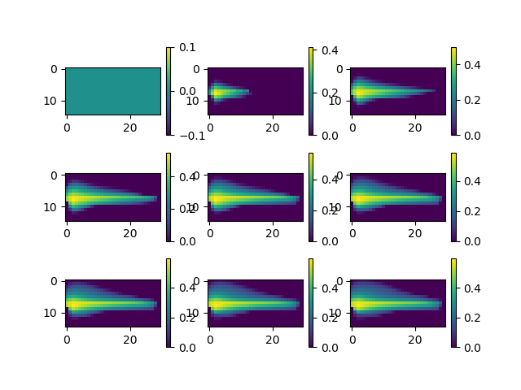
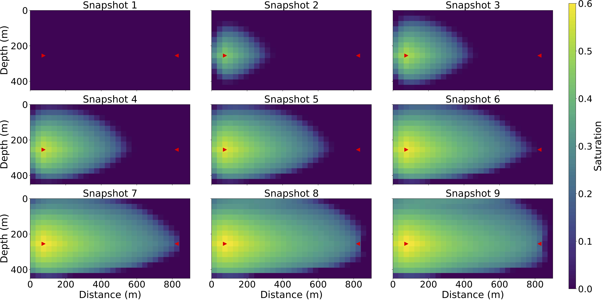
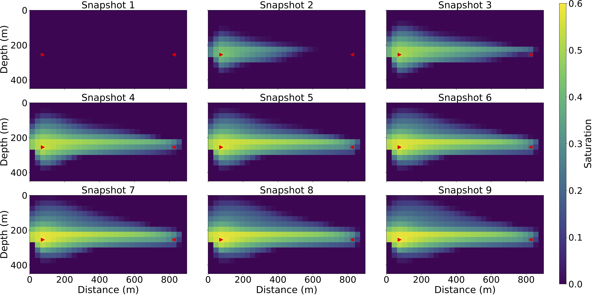

# Flow Inversion


```julia
const K_CONST =  9.869232667160130e-16 * 86400 * 1e3
const ALPHA = 1.0
mutable struct Ctx
  m; n; h; NT; Δt; Z; X; ρw; ρo;
  μw; μo; K; g; ϕ; qw; qo; sw0
end

function tfCtxGen(m,n,h,NT,Δt,Z,X,ρw,ρo,μw,μo,K,g,ϕ,qw,qo,sw0,ifTrue)
  tf_h = constant(h)
  # tf_NT = constant(NT)
  tf_Δt = constant(Δt)
  tf_Z = constant(Z)
  tf_X= constant(X)
  tf_ρw = constant(ρw)
  tf_ρo = constant(ρo)
  tf_μw = constant(μw)
  tf_μo = constant(μo)
  # tf_K = isa(K,Array) ? Variable(K) : K
  if ifTrue
    tf_K = constant(K)
  else
    tf_K = Variable(K)
  end
  tf_g = constant(g)
  # tf_ϕ = Variable(ϕ)
  tf_ϕ = constant(ϕ)
  tf_qw = constant(qw)
  tf_qo = constant(qo)
  tf_sw0 = constant(sw0)
  return Ctx(m,n,tf_h,NT,tf_Δt,tf_Z,tf_X,tf_ρw,tf_ρo,tf_μw,tf_μo,tf_K,tf_g,tf_ϕ,tf_qw,tf_qo,tf_sw0)
end

function Krw(Sw)
    return Sw ^ 1.5
end

function Kro(So)
    return So ^1.5
end

function ave_normal(quantity, m, n)
    aa = sum(quantity)
    return aa/(m*n)
end


# variables : sw, u, v, p
# (time dependent) parameters: qw, qo, ϕ
function onestep(sw, p, m, n, h, Δt, Z, ρw, ρo, μw, μo, K, g, ϕ, qw, qo)
    # step 1: update p
    # λw = Krw(sw)/μw
    # λo = Kro(1-sw)/μo
    λw = sw.*sw/μw
    λo = (1-sw).*(1-sw)/μo
    λ = λw + λo
    q = qw + qo + λw/(λo+1e-16).*qo
    # q = qw + qo
    potential_c = (ρw - ρo)*g .* Z

    # Step 1: implicit potential
    Θ = upwlap_op(K * K_CONST, λo, potential_c, h, constant(0.0))

    load_normal = (Θ+q/ALPHA) - ave_normal(Θ+q/ALPHA, m, n)

    # p = poisson_op(λ.*K* K_CONST, load_normal, h, constant(0.0), constant(1))
    p = upwps_op(K * K_CONST, λ, load_normal, p, h, constant(0.0), constant(0)) # potential p = pw - ρw*g*h 

    # step 2: implicit transport
    sw = sat_op(sw, p, K * K_CONST, ϕ, qw, qo, μw, μo, sw, Δt, h)
    return sw, p
end


"""
impes(tf_ctx)
Solve the two phase flow equation. 
`qw` and `qo` -- `NT x m x n` numerical array, `qw[i,:,:]` the corresponding value of qw at i*Δt
`sw0` and `p0` -- initial value for `sw` and `p`. `m x n` numerical array.
"""
function imseq(tf_ctx)
    ta_sw, ta_p = TensorArray(NT+1), TensorArray(NT+1)
    ta_sw = write(ta_sw, 1, tf_ctx.sw0)
    ta_p = write(ta_p, 1, constant(zeros(tf_ctx.m, tf_ctx.n)))
    i = constant(1, dtype=Int32)
    function condition(i, tas...)
        i <= tf_ctx.NT
    end
    function body(i, tas...)
        ta_sw, ta_p = tas
        sw, p = onestep(read(ta_sw, i), read(ta_p, i), tf_ctx.m, tf_ctx.n, tf_ctx.h, tf_ctx.Δt, tf_ctx.Z, tf_ctx.ρw, tf_ctx.ρo, tf_ctx.μw, tf_ctx.μo, tf_ctx.K, tf_ctx.g, tf_ctx.ϕ, tf_ctx.qw[i], tf_ctx.qo[i])
        ta_sw = write(ta_sw, i+1, sw)
        ta_p = write(ta_p, i+1, p)
        i+1, ta_sw, ta_p
    end

    _, ta_sw, ta_p = while_loop(condition, body, [i, ta_sw, ta_p])
    out_sw, out_p = stack(ta_sw), stack(ta_p)
end

```

```julia
using FwiFlow
using PyCall
using LinearAlgebra
using DelimitedFiles
np = pyimport("numpy")

const SRC_CONST = 86400.0 #
const GRAV_CONST = 9.8    # gravity constant

# Hyperparameter for flow simulation
m = 15
n = 30
h = 30.0 # meter
NT  = 50
dt_survey = 5
Δt = 20.0 # day
z = (1:m)*h|>collect
x = (1:n)*h|>collect
X, Z = np.meshgrid(x, z)

ρw = 501.9
ρo = 1053.0
μw = 0.1
μo = 1.0

K_init = 20.0 .* ones(m,n) # initial guess of permeability 

g = GRAV_CONST
ϕ = 0.25 .* ones(m,n)
qw = zeros(NT, m, n)
qw[:,9,3] .= 0.005 * (1/h^2)/10.0 * SRC_CONST
qo = zeros(NT, m, n)
qo[:,9,28] .= -0.005 * (1/h^2)/10.0 * SRC_CONST
sw0 = zeros(m, n)
survey_indices = collect(1:dt_survey:NT+1) # 10 stages
n_survey = length(survey_indices)


K = 20.0 .* ones(m,n) # millidarcy
K[8:10,:] .= 120.0
# K[17:21,:] .= 100.0
# for i = 1:m
#     for j = 1:n
#         if i <= (14 - 24)/(30 - 1)*(j-1) + 24 && i >= (12 - 18)/(30 - 1)*(j-1) + 18
#             K[i,j] = 100.0
#         end
#     end
# end
tfCtxTrue = tfCtxGen(m,n,h,NT,Δt,Z,X,ρw,ρo,μw,μo,K,g,ϕ,qw,qo, sw0, true)
out_sw_true, out_p_true = imseq(tfCtxTrue)
```




```julia
tfCtxInit = tfCtxGen(m,n,h,NT,Δt,Z,X,ρw,ρo,μw,μo,K_init,g,ϕ,qw,qo, sw0, false)
out_sw_init, out_p_init = imseq(tfCtxInit)

sess = Session(); init(sess)
O = run(sess, out_sw_init)
vis(O)
# NOTE Compute FWI loss


loss = sum((out_sw_true-out_sw_init)^2)
opt = ScipyOptimizerInterface(loss, options=Dict("maxiter"=> 100, "ftol"=>1e-12, "gtol"=>1e-12),var_to_bounds = Dict(tfCtxInit.K=>(10.0, 130.0)))
       

__cnt = 0
__loss = 0
out = []
function print_loss(l)
    if mod(__cnt,1)==0
        println("iter $__cnt, current loss=",l)
    end
    global __loss = l
    global __cnt += 1
end
__iter = 0
function step_callback(rk)
    if mod(__iter,1)==0
        println("================ ITER $__iter ===============")
    end
    println("$__loss")
    push!(out, __loss)
    global __iter += 1
end
sess = Session(); init(sess)
ScipyOptimizerMinimize(sess, opt, loss_callback=print_loss, 
        step_callback=step_callback, fetches=[loss])

```


We can visualize `K` with 
```julia
imshow(run(sess, tfCtxInit.K), extent=[0,n*h,m*h,0]);
xlabel("Distance (m)")
ylabel("Depth (m)")
cb = colorbar()
clim([20, 120])
cb.set_label("Permeability (md)")
```



