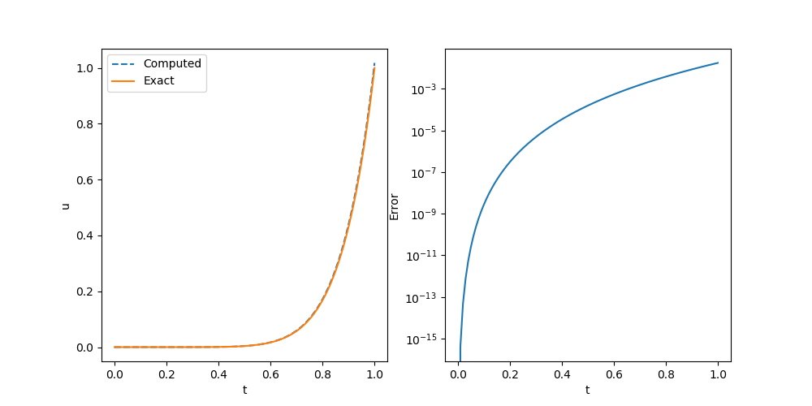

# Time Fractional Differential Equation

The fractional calculus has motivated development and application of novel algorithms and models for describing anomoulous diffusion. In this section, we discuss how to carry out numerical simulation of time fractional differential equations and the corresponding inversion. The major operator in FwiFlow is [`time_fractional_op`](@ref) and [`time_fractional_t_op`](@ref).


We consider the function 
```math
u(t) = t^\beta
```
Then the corresponding time derivative is 
```math
D^\alpha_{t_0}u(t) = \frac{\Gamma(\beta+1)}{\Gamma(\beta-\alpha+1)} t^{\beta-\alpha}
```

```julia
using FwiFlow
Γ = x->exp(tf.math.lgamma(convert_to_tensor(x)))


function u(t, α)
  t^β
end
function du(t, α)
  Γ(β+1)/Γ(β-α+1)* t^(β-α)
end

β = 8.0
α = 0.8
NT = 100
f = (t, u, θ) -> du(t, α)
uout = time_fractional_op(α, f, 1.0, 0.0, NT)

sess = Session(); init(sess)
uval = run(sess, uout)
```

We can compare the exact solution and the numerical solution and they are nearly the same.



We can also measure the convergence order in terms of mean square error (MSE)

| $\alpha=0.2$ | Rate | $\alpha=0.5$ | Rate | $\alpha=0.8$ | Rate |
| ------------ | ---- | ------------ | ---- | ------------ | ---- |
| 7.1536E-04   |      | 3.4743E-03   |      | 1.1166E-02   |      |
| 2.2060E-04   | 1.70 | 1.2516E-03   | 1.47 | 4.7746E-03   | 1.23 |
| 6.7502E-05   | 1.71 | 4.5055E-04   | 1.47 | 2.0644E-03   | 1.21 |
| 2.0484E-05   | 1.72 | 1.6170E-04   | 1.48 | 8.9669E-04   | 1.20 |
| 6.1669E-06   | 1.73 | 5.7842E-05   | 1.48 | 3.9018E-04   | 1.20 |

Now we consider **inverse modeling**. In this problem, $\alpha$ is not know and we can only observe part of the solution. For example, we only know $u(2.0)$, initial conditions and the source function and we want to estimate $\alpha$. We can mark $\alpha$ as an independent variable for optimization by using `Variable` key word.

```julia
using FwiFlow
Γ = x->exp(tf.math.lgamma(convert_to_tensor(x)))

function u(t, α)
  t^β
end
function du(t, α)
  Γ(β+1)/Γ(β-α+1)* t^(β-α)
end

β = 8.0
α = Variable(0.5)
NT = 200
f = (t, u, θ) -> du(t, 0.8)
uout = time_fractional_op(α, f, 1.0, 0.0, NT)
loss = (uout[NT+1] - 1.0)^2

sess = Session(); init(sess)
opt = ScipyOptimizerInterface(loss, method="L-BFGS-B",options=Dict("maxiter"=> 100, "ftol"=>1e-12, "gtol"=>1e-12), var_to_bounds=Dict(α=>(0.0,1.0)))
ScipyOptimizerMinimize(sess, opt)
@show run(sess, α)
```

We have the estimation

```math
\alpha = 0.8036829691152347
```

